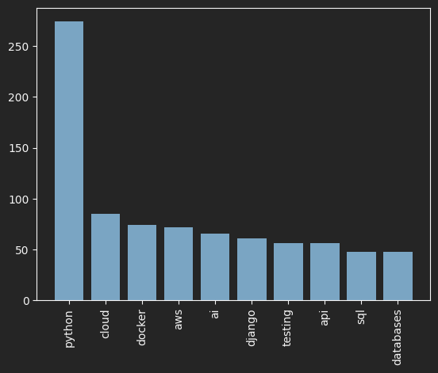

# Python Data Analyzer for Job Vacancies

This script allows you to parse Python job vacancies from the site dou.ua and analyze trends in the stack.
It parses each vacancy and creates a CSV file named `vacancies.csv`. After parsing, you can visualize the data using `pyplot`.

## Features

- **Vacancy Parsing**: Extracts job vacancy descriptions and saves them to `vacancies.csv`.
- **Data Visualization**: Provides visualizations of trends in the data using `matplotlib.pyplot`.

## Getting Started

Follow these steps to get the project up and running:

1. **Install Requirements**: Ensure you have all the necessary packages installed. You can do this by running:
    ```bash
    pip install -r requirements.txt
    ```

2. **Run the Script**:
    - Open and edit `custom_stop_words.py` to add any custom stop words you need.
    - Run the script to start parsing job vacancies:
      ```bash
      python custom_stop_words.py
      ```

3. **Analyze the Data**:
    - Once the CSV file (`vacancies.csv`) is created, open `data.ipynb` using Jupyter Notebook or any compatible environment.
    - Run the cells in `data.ipynb` to visualize the data. The notebook will generate plots using `pyplot`.

4. **Extend Stop Words**:
    - To add or modify stop words, simply update the list in `custom_stop_words.py`.

## Example Visualization



## Notes

- Ensure you have a working internet connection for the web scraping part of the script.
- Customize the script and notebook as needed to fit your analysis requirements.

